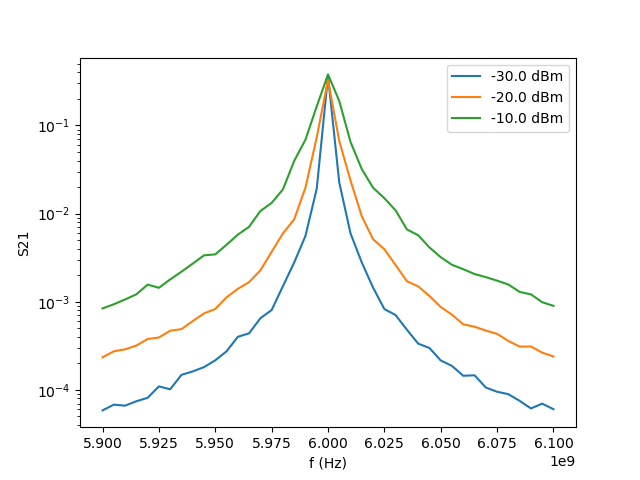
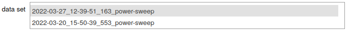
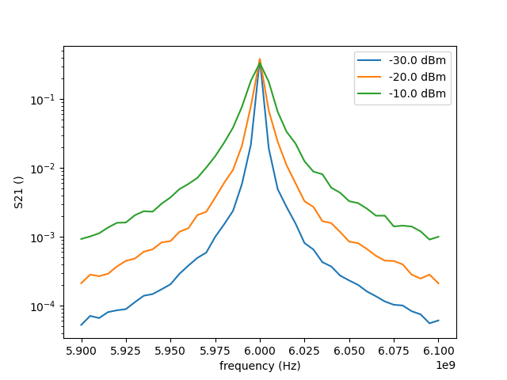

.. pdata documentation master file, created by sphinx-quickstart
   You can adapt this file completely to your liking, but it should at least
   contain the root `toctree` directive.

pdata: Simple-to-understand and robust data storage for experimental data
=========================================================================

This *procedural* data storage package provides a self-contained
interface **focused exclusively on storing and reading experimental
data**, using an approach **independent of the specific measurement
framework used for instrument control**.

The main goals are to provide an interface that:

  * Maximizes the amount of automatically stored metadata, without relying on the experimenter specifying which values are worthy of saving.
  * Is "procedural" rather than "functional" in terms of the API the experimenter sees, as procedural programming tends to be easier to understand for a typical experimental physicist who is not a thoroughly trained programmer.
  * The API aims to be self-explanatory, wherever possible.

In practice, the experimenter calls an explicit :code:`add_points(<new
data points>)` function to add rows to a traditional table of data
points, with user-defined columns. In the background, **pdata
automatically records all changes to instrument parameters**, each
time :code:`add_points` is called.

In addition, pdata provides useful helpers for reading back the
automatically recorded instrument parameters.

Saving data in measurement script
---------------------------------

You can find an example of running a measurement using `QCoDeS
<https://github.com/QCoDeS/Qcodes>`_ for instrument control but pdata
for data storage and regular python for loops etc. for flow control
under the :code:`examples` directory.

The essential part of running the measurement is::

  # Define a function that gets the current instrument settings from QCoDeS (as a dict)
  import qcodes.station
  get_qcodes_instrument_snapshot = lambda s=qcodes.station.Station.default: s.snapshot(update=True)

  from pdata.procedural_data import run_measurement

  # Columns are specified as (<name>, <unit>), or just <name> if the quantity is dimensionless.
  with run_measurement(get_qcodes_instrument_snapshot,
                       columns = [("frequency", "Hz"),
                                  "S21"],
                       name='power-sweep', # <-- arbitrary str descriptive of measurement type
                       data_base_dir=data_root) as m:

    logging.warning('This test warning will (also) end up in log.txt within the data dir.')

    data_path = m.path()
    logging.warning(f'Data directory path = {m.path()}.')

    for p in [-30, -20, -10]:
      vna.power(p) # <-- note that this new value gets automatically stored in the data
      freqs, s21 = vna.acquire_S21()
      m.add_points({'frequency': freqs, 'S21': s21})

Reading data in analysis scripts
--------------------------------

Here is how you read the data back from the above example using DataView::

  from pdata.analysis.dataview import DataView, PDataSingle

  d = DataView([ PDataSingle(data_path), ]) # <-- You can concatenate multiple data dirs by adding multiple PDataSingle's to the array

  print('Instruments in the snapshot file:')
  print(d.settings()[0][1]['instruments'].keys())

  # Add a "column" to the data table based on a value from the snapshot.
  d.add_virtual_dimension('VNA power',
                          from_set=('instruments', 'vna',
                                    'parameters', 'power', 'value'))

  # You can now access the columns by name:
  print('\nFirst few frequencies: %s' % (d["frequency"][:5]))
  print('First few powers: %s' % (d["VNA power"][:5]))

  print('\nUnique powers in the data set: %s' % (np.unique(d["VNA power"])))

  print('\nSweeps based on a per-sweep-fixed parameter: %s' % d.divide_into_sweeps('VNA power'))

  print('\nSweeps based on a per-sweep-swept parameter: %s' % d.divide_into_sweeps('frequency'))

Which outputs the following from the print statements::

  Instruments in the snapshot file:
  dict_keys(['vna'])

  First few frequencies: [5.900e+09 5.905e+09 5.910e+09 5.915e+09 5.920e+09]
  First few powers: [-30. -30. -30. -30. -30.]

  Unique powers in the data set: [-30. -20. -10.]

  Sweeps based on a per-sweep-fixed parameter: [slice(0, 41, None), slice(41, 82, None), slice(82, 123, None)]

  Sweeps based on a per-sweep-swept parameter: [slice(0, 41, None), slice(41, 82, None), slice(82, 123, None)]

Often, you would next use :code:`divide_into_sweeps` to plot your data
as sweeps using your favorite plotting library::

  import matplotlib.pyplot as plt
  fig, ax = plt.subplots()

  for s in d.divide_into_sweeps('frequency'):
  #for s in d.divide_into_sweeps('VNA power'):  # <-- This would work equally well.
    dd = d.copy(); dd.mask_rows(s, unmask_instead=True)
    power = dd.single_valued_parameter('VNA power')
    ax.plot(dd['frequency'], dd['S21'], label="%s dBm" % power)

  ax.set(xlabel='f (Hz)', ylabel='S21')
  ax.set_yscale('log')
  ax.legend();

Data explorer
-------------

There are some helpers in :code:`pdata.analysis.dataexplorer` for
quick visualization of data sets.

You can use :code:`data_selector` in a Jupyter notebook to create an
interactive element for easily selecting data sets from a given
directory::

  sel = dataexplorer.data_selector(data_root)
  display(sel)

Then use :code:`basic_plot` in a separate Jupyter notebook cell to
actually generate a plot of S21 vs frequency for the selected data
sets::

  dataexplorer.basic_plot(data_root, sel.value, "frequency", "S21", ylog=True)

That will already create a plot similar to the above manually created
one, but to also add VNA power in the legend, you can add a
:code:`preprocessor` that adds VNA power as a virtual dimensions so
that it can be used as a :code:`slowcoordinate` for the plot::

  def add_vdims(dd):
    dd.add_virtual_dimension('VNA power', units="dBm",
                              from_set=('instruments', 'vna',
                                        'parameters', 'power', 'value'))
    return dd

  dataexplorer.basic_plot(data_root, sel.value,
                          "frequency", "S21",
                          slowcoordinate="VNA power",
                          ylog=True,
                          preprocessor=add_vdims)

Data format
-----------

The goal of the data format is to be self-documenting, such that it is
possible to figure out what it is, even without the pdata source or
binary package. Therefore the data format is:

  * Relatively verbose (i.e. **not** optimized for size).
  * Based on text files and other wide-spread formats (.gz, .json).
  * Includes a README file in each data directory.
  * Includes a copy of the measurement script, if possible.

.. note::
  Nevertheless, you should *always* read in the data using
  :code:`pdata.analysis.dataview`, which provides plenty of useful functions for
  automatically parsing data not just from the tabular data stored with
  :code:`add_points`, but also the instrument parameters stored in the JSON
  files. Because of the latter, it is highly recommended to use :code:`dataview`
  as a preparser even if you use something else than Python for further
  analysis.

Concretely, a data directory contains the following files:

  * :file:`tabular_data.dat` -- Data table with rows added using :code:`add_points`, and columns defined as arguments of :code:`run_measurement`.
  * :file:`snapshot.json` -- Instrument parameter snapshot when :code:`run_measurement` started.
  * :file:`snapshot.row-<n>.diff<m>.json` -- `jsondiff <https://pypi.org/project/jsondiff/>`_ of parameter changes, recorded when the there were <n> data rows in tabular_data.dat. <m> is a simple counter, in case multiple diffs are created for the same row.
  * :file:`log.txt` -- copy of messages from the logging module.
  * A copy of the Jupyter notebook (.ipynb) or other measurement script, if possible.

  Optionally, the files may be compressed (.gz or .tar.gz).

.. note:: A downside of the chosen data format is that it's relatively
  slow to read from disk to memory. So if you are dealing with larger
  data sets, it's highly recommended to split your analysis script
  into multiple steps and make use of caching parsed values and/or
  intermediate analysis results in cache files. There are several easy
  ways of doing that in Python, for example using `pickle
  <https://docs.python.org/3/library/pickle.html>`_ or `json
  <https://docs.python.org/3/library/json.html>`_

Content in this manual
----------------------------

.. toctree::
    :maxdepth: 2

    Overview <self>
    install
    api
    contributing
